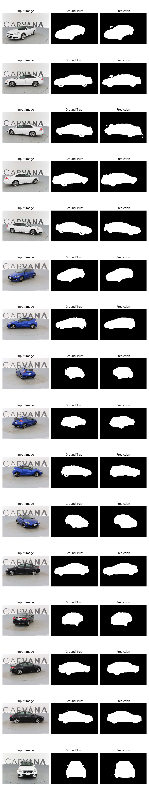

# 🚗 Carvana Image Masking with U-Net in PyTorch  

This project implements a **custom U-Net–style convolutional neural network** in PyTorch for semantic segmentation, trained on the **Kaggle Carvana Image Masking Challenge** dataset. The model generates precise binary masks of cars from high-resolution images.  

---

## 📌 Features  
- **Custom U-Net Architecture**  
  - Encoder–decoder with skip connections  
  - Convolutional + BatchNorm + ReLU blocks  
  - Transposed convolutions for upsampling  

- **Training Pipeline**  
  - Mixed precision training with `torch.cuda.amp.autocast` for efficiency  
  - Adam optimizer with **BCE + Dice loss** for robust mask learning  
  - Real-time training progress with `tqdm`  
  - Prediction visualization during validation  

- **Data Handling**  
  - Custom PyTorch `Dataset` class for Carvana images/masks  
  - **Albumentations** for augmentation: resize, rotation, flips, normalization  
  - Channel-first formatting → `(3,H,W)` for images, `(1,H,W)` for masks  

- **Evaluation Metrics**  
  - Dice coefficient  
  - Pixel accuracy  

## Sample Predictions
